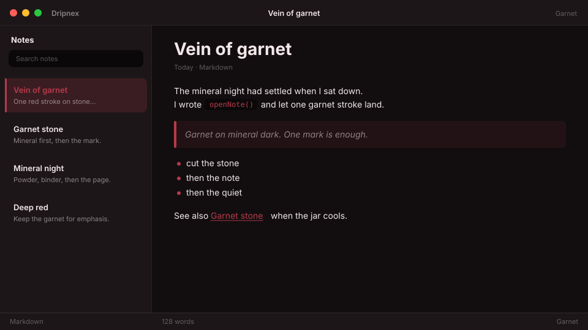

# Garnet

Deep mineral dark. Garnet red mark.



```
dripnex/theme-garnet
```

## Palette

The chips live in [palette.html](palette.html) — open it in a browser. GitHub won’t paint HTML swatches here, so the hex list is below.

| Name | Token | Color | What it’s for |
| --- | --- | --- | --- |
| Base | `--bg-base` | `#120e10` | Window background |
| Surface | `--bg-surface` | `#1c1619` | Sidebar and chrome |
| Elevated | `--bg-elevated` | `#2a2125` | Raised panels |
| Text | `--text-primary` | `#f2e8ea` | Headings and body |
| Muted | `--text-muted` | `#f2e8ea · rgba(242, 232, 234, 0.52)` | Secondary copy |
| Accent | `--accent` | `#b83a4a` | Selection and links |
| Active | `--status-active` | `#b83a4a` | Active status |
| Dropped | `--status-dropped` | `#cf6875` | Dropped status |

Pick it for deep mineral night with a single garnet red mark — not velvet wine, not cinnabar vermillion, not ember glow.
